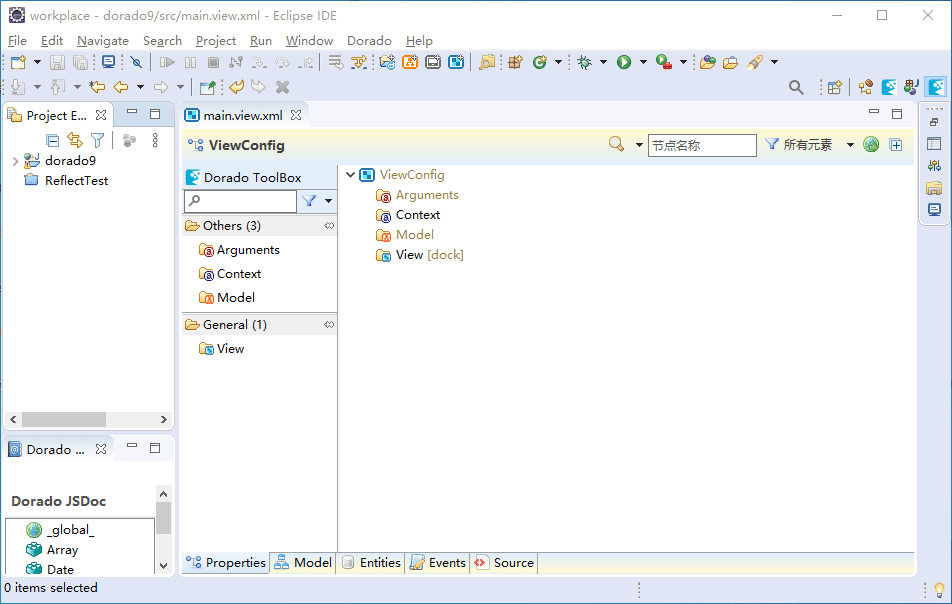

# 本资源谢绝上传到CSDN！！！

dorado9-ide eclipse插件学习交流版，30天试用期过后无需注册，可直接保存。

此版本仅供个人学习Dorado9框架之用，如想使用此框架发布商业产品，请联系[锐道](http://www.bstek.com/)购买授权版。我们抵制有能力的公司白嫖人家公司的劳动成果。

对个人开发者而言，Dorado 是一个很好使的“懒人框架”，同时Dorado系列插件源码是全部公开的，有助于深入了解。因高度的便捷性，其学习的成本也非常高，啥事不干光学官方那一套教程就得花上一个月（我学得慢），想要定制的话就是完全考验Spring基本功了。

不过，仁者见仁智者见智，可能不同的人有不同的看法。不过这都不是重点，只要一起抵制CSDN，大家都是朋友（笑）。

希望锐道也能开放IDEA插件与maven版，当然，如果开通**个人授权版**才能使用那就更好了，毕竟，真的很香啊！